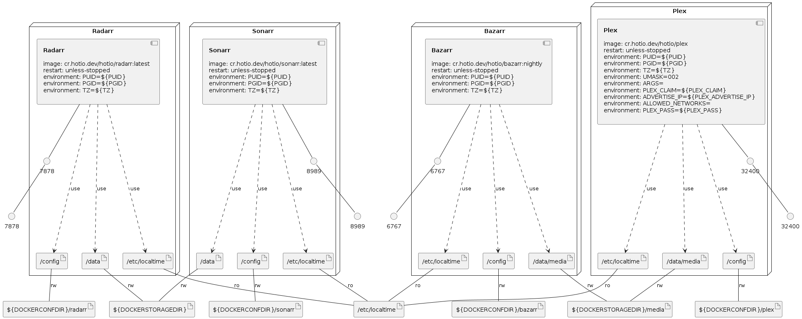

# Guides-Synology-Templates

Here you will find a collection of docker-compose's for Synology related to [TRaSH-Guides](https://trash-guides.info/).

## How to make use of this

Search in the `templates` folder for the application you want and copy/paste it in to your `docker-compose.yml`
in the `<application>.yml` file you will also find the command you need to use in a program like putty to create the correct appdata folder for your docker `/config`

### Info

I made use of [DockSTARTer](https://github.com/GhostWriters/DockSTARTer/tree/master/compose/.apps) as base for the the templates.

### Infrastructure model

